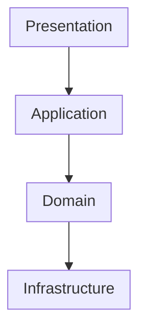
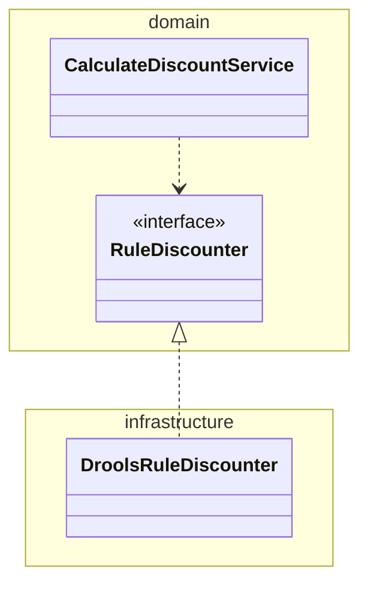

## 2.1 네 개의 영역

영역의 종류

* 표현(presentation) 영역
* 응용(application) 영역
* 도메인(domain) 영역
* 인프라스트럭처(infrastructure) 영역

### 표현 영역

* 표현 영역은 사용자의 요청을 받아 응용 영역에 전달하고 응용 영역의 처리 결과를 다시 사용자에게 보여주는 역할을 한다.
* 사용자는 웹 브라우저를 사용하는 사람일 수도 있고 REST API를 호출하는 외부 시스템일 수도 있다.
* 웹 애플리케이션에서 표현 영역은 HTTP 요청을 **응용 영역이 필요로 하는 형식으로 변환**해서 응용 영역에 전달하고 응용 영역의 응답을 HTTP 응답으로 변환하여 전송한다.

### 응용 영역

* 응용 영역은 로직을 직접 수행하기보단 **도메인 모델에 로직 수행을 위임**한다.
* 응용 영역은 트랜잭션을 관리한다. (p. 88)

### 도메인 영역

* 도메인 영역은 핵심 로직을 도메인 모델에서 구현한다.
* 예를 들어, 주문 도메인에서 배송지 변경, 결제 완료 등이 핵심 로직에 해당한다.

### 인프라스트럭처 영역

* 인프라스트럭처 영역은 구현 기술에 대한 것을 다룬다.
* 데이터베이스나 메시징 시스템, 외부 시스템과의 연동 등이 해당된다.
* 도메인 영역, 응용 영역, 표현 영역은 구현 기술을 사용한 코드를 직접 만들지 않고 인프라스트럭처 영역에서 제공하는 기능을 사용한다.

## 2.2 계층 구조 아키텍처

네 영역을 구성할 때 많이 사용하는 아키텍처는 아래와 같다. 도메인 복잡도에 따라 응용과 도메인은 합쳐질 수도 있다.

* 계층 구조는 상위 계층에서 하위 계층으로의 의존만 존재한다.
* 엄격한 계층 구조에선 상위 계층은 바로 아래 계층에만 의존해야 한다.
* 유연한 계층 구조에선 상위 계층이 바로 아래 계층뿐만 아니라 그 아래 계층에도 의존할 수 있다.

### 인프라스트럭처 영역 의존도

* 위 구조를 따르면 표현, 응용, 도메인 계층이 상세한 구현 기술을 다루는 인프라스트럭처 계층에 의존한다.
* 인프라스트럭처에 의존하면 **테스트 어려움**과 **기능 확장 어려움**이라는 두 가지 문제가 발생한다.
* 테스트 어려움
    * 인프라스트럭처 계층은 구현 기술에 대한 코드를 직접 포함하기 때문에 테스트하기 어렵다.
    * 테스트를 위해 인프라스트럭처 계층을 완전하게 준비해야한다.
* 기능 확장 어려움
    * 인프라스트럭처 계층은 구현 기술에 대한 코드를 직접 포함하기 때문에 구현 기술을 변경하면 인프라스트럭처 계층의 코드를 모두 변경해야 한다.

## 2.3 DIP

### 고수준 모듈과 저수준 모듈

* 고수준 모듈은 의미 있는 단일 기능을 제공한다.
    * 고수준 모듈의 기능을 구현하려면 여러 하위 기능이 필요하다.
* 저수준 모듈은 하위 기능을 실제로 구현한다.
* 앞서 살펴본 것처럼 고수준 모듈이 저수준 모듈을 사용하면 구현 변경과 테스트가 어렵다는 문제가 발생한다.

### How to

* DIP는 이 문제를 해결하기 위해 저수준 모듈이 고수준 모듈에 의존하도록 바꾼다.
* 고수준 모듈에서 필요한 하위 기능을 인터페이스로 정의한 후 인터페이스를 의존한다.
* 저수준 모듈은 정의된 인터페이스를 구현함으로써 고수준 모듈에 의존하면서 하위 기능을 제공한다.
* 고수준 모듈이 저수준 모듈을 사용하려면 고수준 모듈이 저수준 모듈을 의존해야하는데 반대로 의존한다고 하여 DIP(dependency inversion principle)라고 한다.

### 장점

* 고수준 모듈이 의존하고 있는 인터페이스의 구현체를 주입받으면 객체 생성 코드만 변경함으로써 구현 기술을 쉽게 변경할 수 있다.
* Mock 프레임워크를 이용해서 의존 객체를 쉽게 정의하여 테스트를 할 수 있다.

### 주의 사항

* DIP는 단순히 인터페이스와 구현 클래스를 분리하는 것이 아니다.
* DIP를 적용할 때 하위 기능을 추상화한 인터페이스는 고수준 모듈 관점에서 도출한다.

* DIP를 항상 적용할 필요는 없다. 사용하는 구현 기술에 따라 완벽한 DIP를 적용하기보다는 구현 기술에 의존적인 코드를 도메인에 일부 포함하는게 효과적일 때도 있다.

## 2.4 도메인 영역의 주요 구성요소

### 도메인 영역을 구성하는 요소

* 엔티티: 고유의 식별자를 갖는 객체로 자신의 라이프 사이클을 갖으며 도메인의 고유한 개념을 표현한다. 도메인 모델의 데이터를 포함하며 해당 데이터와 관련된 기능을 함께 제공한다.
* 밸류: 고유의 식별자를 갖지 않는 객체로 개념적으로 하나인 값을 표현한다. 엔티티의 속성으로 사용할 뿐만 아니라 다른 밸류 타입의 속성으로도 사용한다.
* 애그리거트: 연관된 엔티티와 밸류 객체를 개념적으로 하나로 묶은 것
* 리포지터리: 도메인 모델의 영속성을 처리한다.
* 도메인 서비스: 특정 엔티티에 속하지 않은 도메인 로직을 제공한다. 도메인 로직이 여러 엔티티와 밸류를 필요로하면 도메인 서비스에서 구현한다.

### 엔티티와 밸류

* 도메인 모델의 엔티티와 데이터베이스 모델의 엔티티는 같지 않다.
    * 도메인 모델의 엔티티는 데이터와 함께 도메인 기능을 제공한다.
        * 데이터베이스 모델의 엔티티는 데이터만 표현한다.
    * 도메인 모델의 엔티티는 두 개 이상의 데이터가 개념적으로 하나인 경우 밸류 타입을 이용해서 표현할 수 있다.
        * 데이터베이스 모델의 엔티티는 모두 풀어서 표현한다.

### 애그리거트

* 애그리거트는 관련 객체를 하나로 묶은 군집이며 군집에 속한 객체를 관리하는 루트 엔티티를 갖는다.
* 애그리거트를 사용하면 관련 객체를 묶어서 객체 군집 단위로 모델을 바라볼 수 있어 개별 객체 간의 관계가 아닌 애그리거트 간의 관계로 도메인 모델을 이해할 수 있다.
* 루트 엔티티는 애그리거트에 속해 있는 엔티티와 밸류 객체를 이용해서 애그리거트가 구현해야할 기능을 제공한다.
* 애그리거트를 사용하는 코드는 애그리거트 루트가 제공하는 기능을 실행하고 애그리거트 루트를 통해 간접적으로 애그리거트 내의 다른 엔티티나 밸류 객체에 접근한다.
* 이는 애그리거트의 내부 구현을 숨겨서 **애그리거트 단위로 구현을 캡슐화** 할 수 있도록 돕는다.
* 애그리거트에서는 **루트 엔티티를 통하지않고 다른 객체를 변경할 수 있는 방법을 제공하지 않는다.**

### 리포지터리

* 리포지터리는 애그리거트 단위로 도메인 객체를 저장하고 조회하는 기능을 정의한다.
* 도메인 모델 관점에서 리포지터리는 도메인 객체를 영속화하는 데 필요한 기능을 추상화한 것으로 고수준 모듈에 속한다. 따라서 기반 기술을 이용해서 리포지터리를 구현한 클래스는 저수준 모듈로 인프라스트럭쳐 영역에
  속한다.

## 2.5 요청 처리 흐름

* 표현 영역은 사용자가 전송한 **데이터 형식이 올바른지 검사**하고 문제가 없다면 데이터를 이용해서 응용 서비스에 기능 실행을 위임한다.
* 표현 영역은 사용자가 전송한 데이터를 **응용 서비스가 요구하는 형식으로 변환해서 전달**한다.

## 2.6 인프라스트럭처 개요

* 인프라스트럭처는 표현 영역, 응용 영역, 도메인 영역을 지원한다.
* 다른 영역에서 인프라스트럭처의 기능을 직접 사용하는 것보다 DIP를 사용하는 것이 시스템을 더 유연하게 만든다.
* 그러나, 무조건 인프라스트럭처에 대한 의존을 없앨 필요는 없다. DIP의 장점만큼 구현의 편리함의 장점도 중요하기 때문이다.
* 응용 영역과 도메인 영역이 인프라스트럭처에 대한 의존을 완전히 갖지 않도록 시도하는 것은 자칫 구현을 더 복잡하고 어렵게 만들 수 있기 때문이다.

## 2.7 모듈 구성

* 모듈 구조를 얼마나 세분화해야 하는지에 대해 정해진 규칙은 없다. 한 패키지에 너무 많은 타입이 몰려서 코드를 찾을 때 불편한 정도만 아니면 된다.
* 한 패키지에 가능하면 10~15개 미만으로 타입 개수를 유지하려고 노력해보자.

## 👻 후기

application 레이어에서 객체 컬렉션을 일급 컬렉션으로 감싼 후에 로직을 처리하는 것이 어색했는데 `응용 영역은 로직을 직접 수행하기보단 도메인 모델에 로직 수행을 위임한다.`를 보고 적절한 방법이었음을
알았다.

데이터베이스의 엔티티와 도메인 모델의 엔티티의 차이를 알 수 있었다. 특히, JPA를 쓰면서 엔티티가 테이블 구조와 일치한다고 생각했었는데, 돌이켜보면 밸류 타입을 사용하여 여러 컬럼을 하나의 객체로 표현하거나
엔티티의 메서드로 도메인 로직을 수행하고 있었다.

표현 영역에서 데이터 형식을 검사하고 응용 서비스가 원하는 대로 전달해야한다는 부분을 읽고 표현 영역의 역할을 분명히 할 수 있었다.

그럼 표현 영역이 원하는 형식과 응용 영역이 원하는 형식이 다르지만 구현의 편리함을 위해 응용 영역의 형식으로 통일하는 경우 @Validation의 존재가 애매해진다. 실제로 검증하는 곳은 표현 영역이지만 해당
DTO 클래스가 응용 영역에 있어 오해를 낳을 수 있다. 그렇다고 DTO와 command 클래스를 따로 만드는 것은 아직까지는 오버 엔지니어링처럼 보여 복잡도만 높이는 것 같다.
